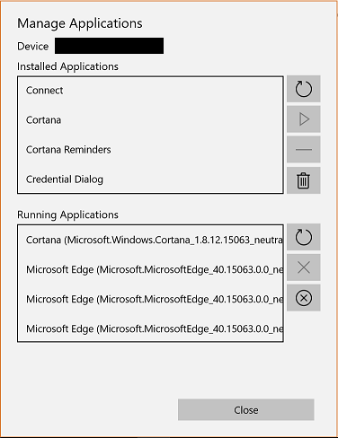
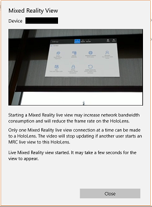

## HoloLens Commander

HoloLens Commander is a Universal Windows application that demonstrates using the Windows Device Portal in a classroom environment. It enables observation and management of one or more HoloLens devices. This application is built upon the open source [Windows Device Portal Wrapper](https://github.com/Microsoft/WindowsDevicePortalWrapper) project and is used by the Microsoft HoloLens team in the Holographic Academy.

### Requirements
HoloLens Commander requires:
- A Windows 10 Device
 - Currently tested on x86 and x64.
- A HoloLens
 - In developer mode
 - [Windows Device Portal](https://developer.microsoft.com/en-us/windows/holographic/using_the_windows_device_portal#setting_up_hololens_to_use_windows_device_portal) enabled and configured

### Building
Building HoloLens Commander requires [Visual Studio 2015 Community and the Windows 10 SDK](https://developer.microsoft.com/en-us/windows/downloads). Visual Studio 2015 Professional and Enterise are also supported.
- Load HoloLensCommander.sln
- Build and deploy the solution.

### How to use HoloLens Commander
Note: The first time you start HoloLens Commander on your PC, you will need to enter credentials or set the default credentials for Windows Device Portal connections to the HoloLens.

#### Connecting to a HoloLens

##### Connect

Connects to the HoloLens that is connected to the PC via a USB connection.

##### Additional connection commands

The additonal connection commands button (...) displays a context sensitive menu providing the following options:

- Reconnect to previous session

The reconnect command enables you to reconnect to the currently available HoloLens devices that were managed in the previous HoloLens Commander session. This command is available only if a HoloLens connection has yet to be established and the User name and Password fields are populated.

- Set credentials as default

Stores the current values of the User name and Password fields as the default credentials to be used when connecting to a HoloLens.

- Use default credentials

Replaces the current values of the User name and Password fields with the stored default credentials.

##### User name

The user name used to connect to the HoloLens.

##### Password

The password used to connect to the HoloLens.

#### Applications
The applications section allows for managing the applications running on multiple HoloLens devices simultaniously.

##### Common applications list
This list shows the applications that are installed on all of the connected HoloLens devices.

##### Refresh
Queries the connected HoloLens devices and updates the lost of common applications.

##### Run
Runs the application selected in the common applications list on the selected HoloLens devices.

##### Close All
Stops all applications that are currently running on the selected HoloLens devices.

##### install
Installs an application on each of the selected HoloLens devices.

##### Uninstall
Uninstalls the application selected in the common applications list from each of the selected HoloLens devices.

#### Mixed Reality Capture
The Mixed Reality Capture control section allows for recording and saving of Mixed Reality Capture videos from the selected HoloLens devices.

##### Start

Starts a Mixed Reality Capture video recording. Users will notice a recording indicator in the upper left of the Holographic Frame and will experience a reduced application frame rate until the recording is stopped.

##### Stop

Stops the Mixed Reality Capture video recording.

##### Save

Files created by the Start and Stop controls, along with any other Mixed Reality Capture files created on the HoloLens (via the Windows Device Portal or a Cortana voice command) will be downloaded to the Photos Library on the PC. Files will be saved to HoloLensManage\<HoloLens address|name>.

##### Delete files after saving

Checking this option will result in downloaded Mixed Reality Capture files to be deleted from the HoloLens.

#### Device controls

The device control controls provide options (from left to right) to:

- Reboot the selected HoloLens devices
- Shut down the selected HoloLens devices
- Forget all connected HoloLens devices

Note: All HoloLens devices will be disconnected and will not be restorable via the Reconnect button.

#### Registered HoloLens list
The right side of the HoloLens Commander interface contains the list of connected HoloLens devices along with Select all and Select none buttons. Each entry provides the ability to select/deselect the specific HoloLens, view summary information related to the HoloLens (battery level, etc.) as well as access to functionality specific to a single HoloLens.

From right to left, the HoloLens Summary view contains:

- Selection check box

Unchecking this box will prevent this HoloLens from responding to commands other than those shown by clicking the Additional commands button, EXCEPT for the clear devices button in the Device Control controls.

- Additional commands button

- HoloLens address and name

The address is the IP address of the HoloLens on your WiFi network. The name is a HoloLens Commander only value that is not transmitted to the HoloLens.

- Battery information and IPD (InterPupilary Distance)

Battery information includes the remaining capacity and an indication as to whether or not the HoloLens is plugged in.

- Status message

##### Additonal commands
##### Tag / IPD

The Tag / IPD dialog allows you to attach a descriptive name to your HoloLens that is not sent to the device. This enables the user of HoloLens Commander to assign the location, for example, without changing settings on the HoloLens.  This dialog also allows you to set the interpupliary distance on the HoloLens. The IPD value is sent to the HoloLens when you click Ok. It will be updated in the HoloLens Summary view with the next status check (aka heartbeat).

##### Manage apps

The Manage apps dialog displays the installed and running applications on the HoloLens. From top to bottom, the available controls are:

 - Refresh the list of installed applications
 - Run the selected application
 - Refresh the list of running applications
 - Close the selected application
 - Close all running applications

##### Mixed Reality view

The Mixed Reality view dialog allows the HoloLens Commander user to see what the HoloLens is seeing. This feed takes a few seconds to initialize and then runs at 15 frames per second (to limit the impact on the wireless network). 

Note: On the HoloLens, the user will see a recording indicator in the upper left of the Holographic Frame and the frame rate will be reduced. Although a recording indicator is displayed, no recording is being created.

##### Show Device Portal

The Show Device Portal command launches the default web browser and connects to the Windows Device Portal on the HoloLens.

##### Disconnect

Disconnects from the HoloLens and removes it from the list.

### Project dependencies
HoloLens Commander depends on:
- Windows Device Portal
The HoloLens must be in developer mode with the Windows Device Portal enabled and paired.
- Windows Device Portal Wrapper
 - https://github.com/Microsoft/WindowsDevicePortalWrapper

### Contributing
We welcome and encourage contributions to the HoloLens Commander project. We look forward to evolving this tool with the community!
